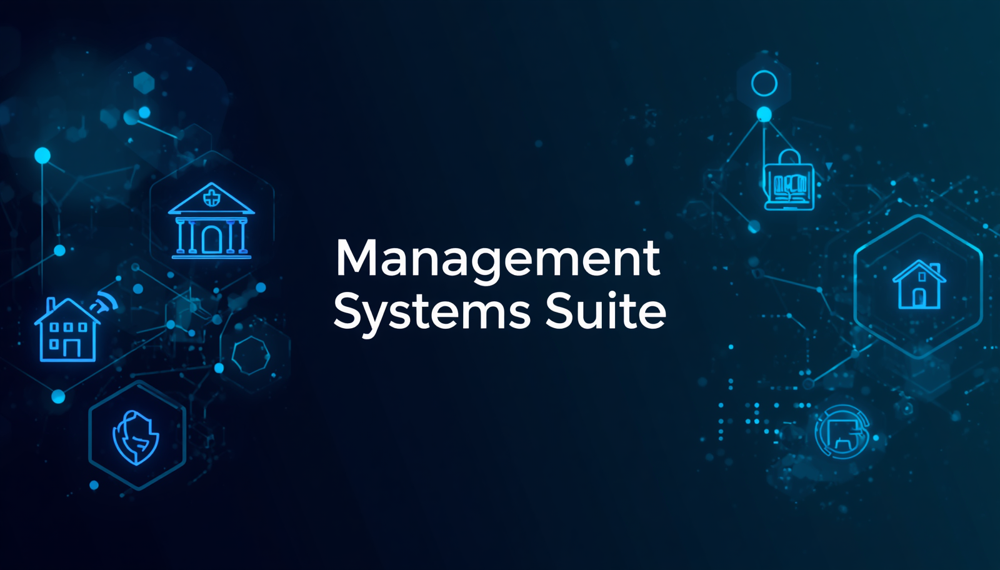

# 🏛️ Management Systems Suite

> Secure, low-level management systems for health facilities, residential buildings, schools, and institutions.

## Overview

The **Management Systems Suite** is a collection of secure management tools designed for organizations that demand data integrity, access control, and resilience against common attack vectors. Built with low-level development practices and system-hardening techniques, each system is tailored to its specific domain while maintaining streamlined operations and user-friendly interfaces.

## Domains

- 🏥 **Health Facilities** – Patient records, appointments, staff scheduling
- 🏫 **Schools** – Student information, attendance, grade management
- 🏘️ **Residential Buildings** – Tenant tracking, maintenance requests, payments
- 🏛️ **Institutions** – Custom workflows for government and organizational needs

## Security Focus

- Memory-safe data handling
- Strict access control mechanisms
- Resilience against injection and tampering
- System-level hardening techniques

## Tech Stack
- **Language:** Zig
- **Database:** PostgreSQL
- **Frontend:** terminal-based, web interface

## Status

🚧 Under active development

## License

*[MIT]*

## Contact

*[Email: 0xi6r@tutamail.com]*
